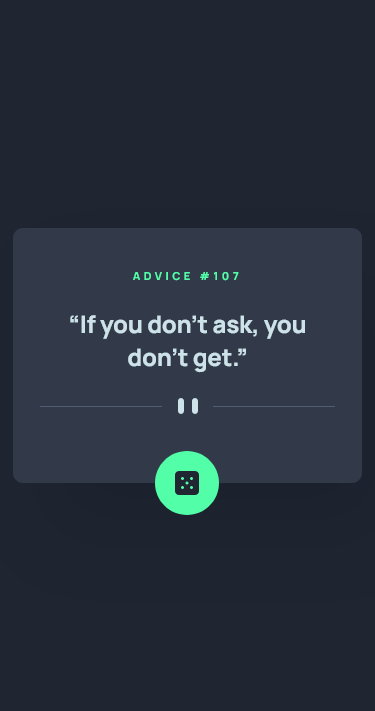
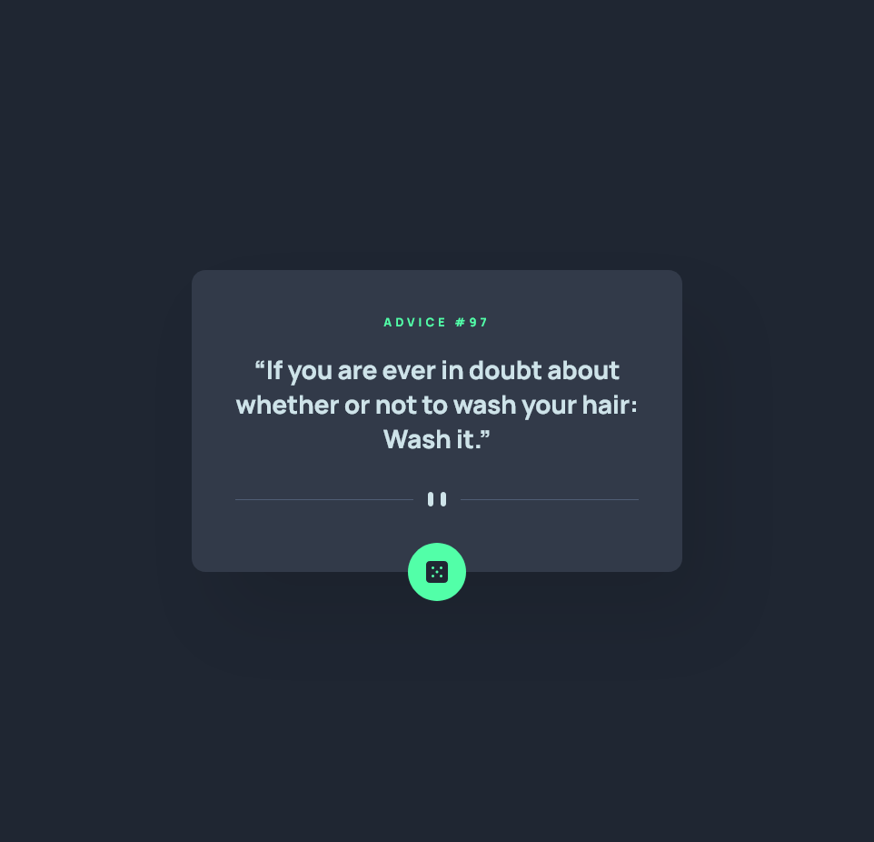

# Frontend Mentor - Advice generator app solution

This is a solution to the [Advice generator app challenge on Frontend Mentor](https://www.frontendmentor.io/challenges/advice-generator-app-QdUG-13db). Frontend Mentor challenges help you improve your coding skills by building realistic projects.

## Table of contents

- [The challenge](#the-challenge)
- [Screenshot](#screenshot)
- [Links](#links)
- [Author](#author)

### The challenge

Users should be able to:

- View the optimal layout for the app depending on their device's screen size
- See hover states for all interactive elements on the page
- Generate a new piece of advice by clicking the dice icon

### Screenshot

### Links

- Solution URL: (https://github.com/gdcristea/advice-generator-app)

- Live Site URL: (https://gdcristea.github.io/advice-generator-app/)

### Author

- Linkedin - [Daniel Cristea](https://www.linkedin.com/in/daniel-cristea-629069191/)

- Frontend Mentor - [@gdcristea](https://www.frontendmentor.io/profile/gdcristea)

- Twitter - [@gdcristea10](https://twitter.com/gdcristea10)
